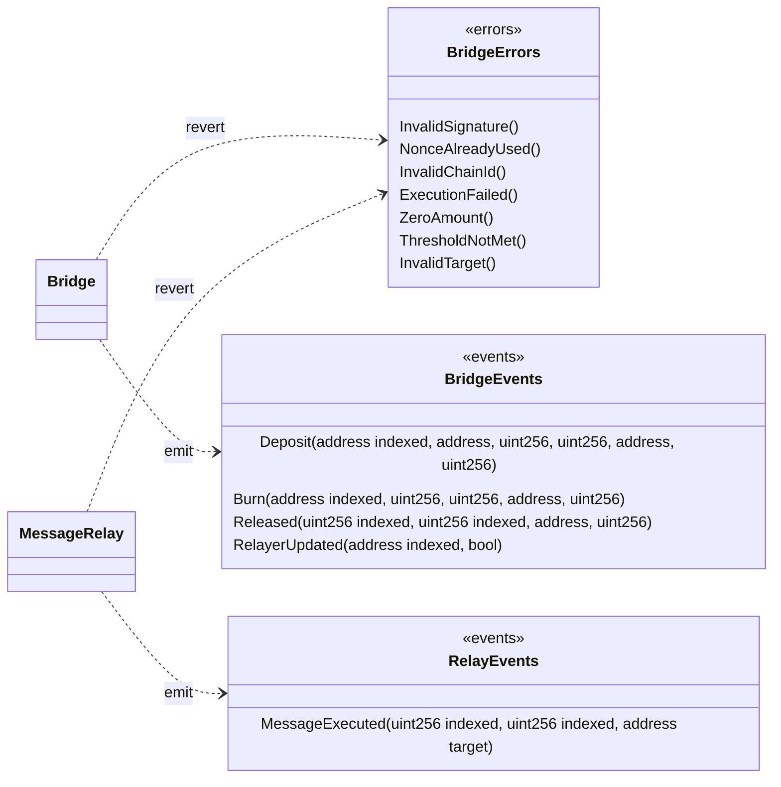
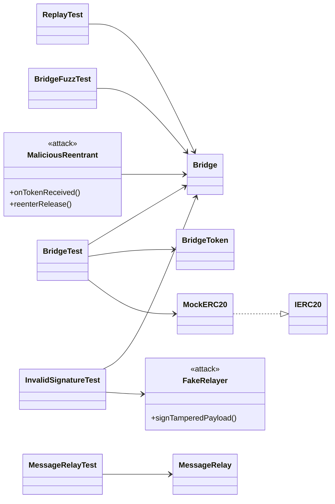
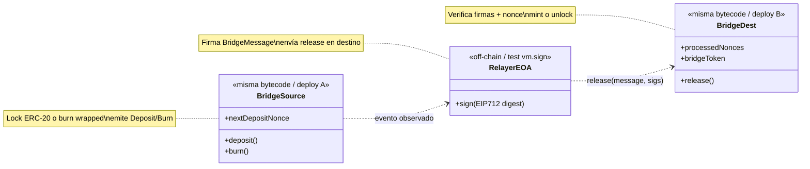

# Diagrama de clases — Cross-Chain Bridge & Message Relay

Modelo estructural **to-be** (módulo 09). Contratos, interfaces EIP-712/ECDSA, tokens y tests.

## 1. Diagrama principal (UML / Mermaid)

```mermaid
classDiagram
    direction TB

    class IERC20 {
        <<interface>>
        +balanceOf(address) uint256
        +transfer(address, uint256) bool
        +transferFrom(address, address, uint256) bool
        +approve(address, uint256) bool
    }

    class IBridge {
        <<interface>>
        +deposit(address token, uint256 amount, uint256 destChainId, address recipient)
        +burn(uint256 amount, uint256 destChainId, address recipient)
        +release(BridgeMessage message, bytes[] signatures)
        +processedNonces(uint256 sourceChainId, uint256 nonce) bool
    }

    class IMessageRelay {
        <<interface>>
        +execute(RelayMessage message, bytes[] signatures)
    }

    class IBridgeToken {
        <<interface>>
        +mint(address to, uint256 amount)
        +burn(address from, uint256 amount)
        +bridge() address
    }

    class BridgeMessage {
        <<struct>>
        uint256 sourceChainId
        uint256 destinationChainId
        uint256 nonce
        address target
        address recipient
        address token
        uint256 amount
    }

    class RelayMessage {
        <<struct>>
        uint256 sourceChainId
        uint256 destinationChainId
        uint256 nonce
        address target
        bytes payload
    }

    class Bridge {
        +mapping processedNonces
        +mapping isRelayer
        +uint256 relayerThreshold
        +uint256 nextDepositNonce
        +address immutable bridgeToken
        +deposit(token, amount, destChainId, recipient)
        +burn(amount, destChainId, recipient)
        +release(BridgeMessage, bytes[])
        -_verifySignatures(bytes32 digest, bytes[] sigs) bool
        -_hashMessage(BridgeMessage) bytes32
    }

    class MessageRelay {
        +mapping processedNonces
        +mapping isRelayer
        +uint256 relayerThreshold
        +execute(RelayMessage, bytes[])
        -_verifySignatures(bytes32 digest, bytes[] sigs) bool
    }

    class BridgeToken {
        +address immutable bridge
        +mint(address to, uint256 amount)
        +burn(address from, uint256 amount)
    }

    class BridgeHash {
        <<library>>
        +BRIDGE_MESSAGE_TYPEHASH bytes32
        +hash(BridgeMessage) bytes32
        +hash(RelayMessage) bytes32
    }

    class EIP712 {
        <<OZ>>
        #_hashTypedDataV4(bytes32) bytes32
        #_domainSeparatorV4() bytes32
    }

    class ECDSA {
        <<OZ library>>
        +recover(bytes32 hash, bytes signature) address
    }

    class SignatureChecker {
        <<OZ library>>
        +isValidSignatureNow(address, bytes32, bytes) bool
    }

    class ReentrancyGuard {
        <<OZ>>
        #nonReentrant()
    }

    class Ownable2Step {
        <<OZ>>
        +owner() address
        +transferOwnership(address)
    }

    class SafeERC20 {
        <<OZ library>>
        +safeTransfer(IERC20, address, uint256)
        +safeTransferFrom(IERC20, address, address, uint256)
    }

    class ERC20 {
        <<OZ>>
        +mint / burn via BridgeToken
    }

    IBridge <|.. Bridge
    IMessageRelay <|.. MessageRelay
    IBridgeToken <|.. BridgeToken
    EIP712 <|-- Bridge
    EIP712 <|-- MessageRelay
    ReentrancyGuard <|-- Bridge
    ReentrancyGuard <|-- MessageRelay
    Ownable2Step <|-- Bridge
    Ownable2Step <|-- MessageRelay
    ERC20 <|-- BridgeToken

    Bridge ..> BridgeMessage : release
    Bridge ..> BridgeHash : typed hash
    Bridge ..> ECDSA : recover
    Bridge ..> SignatureChecker : optional EOA/contract
    Bridge ..> IBridgeToken : mint / burn
    Bridge ..> IERC20 : lock / unlock
    Bridge ..> SafeERC20

    MessageRelay ..> RelayMessage
    MessageRelay ..> BridgeHash
    MessageRelay ..> ECDSA

    BridgeToken ..> Bridge : onlyBridge
```



## 2. Errores y eventos



## 3. Tests y actores



## 4. Responsabilidades

| Artefacto | Rol |
|-----------|-----|
| `Bridge` | Lock/burn origen; verificar EIP-712 + nonces; mint/unlock destino |
| `MessageRelay` | Ejecutar mensajes genéricos firmados (mismo esquema anti-replay) |
| `BridgeToken` | ERC-20 wrapped; mint/burn solo por `bridge` |
| `BridgeHash` | `TYPEHASH` + `structHash` sin estado |
| `EIP712` (OZ) | Domain separator (`name`, `version`, `chainId`, `verifyingContract`) |
| `ECDSA` / `SignatureChecker` | Recuperar firmante / validar firma |
| `ReentrancyGuard` | Impide reentrar `deposit` / `burn` / `release` |
| `Ownable2Step` | Admin del set de relayers y umbral |
| `MaliciousReentrant` | Intenta reentrar `release` tras mint |

## 5. Dependencias (resumen)

```
Bridge
  ├── hereda     → EIP712, ReentrancyGuard, Ownable2Step
  ├── implementa → IBridge
  ├── usa        → BridgeHash, ECDSA, SignatureChecker, SafeERC20
  ├── llama      → IBridgeToken.mint / burn; IERC20 transfer
  ├── estado     → processedNonces, isRelayer, relayerThreshold, nextDepositNonce
  ├── emite      → Deposit / Burn / Released / RelayerUpdated
  └── revierte   → InvalidSignature / NonceAlreadyUsed / InvalidChainId /
                    ExecutionFailed / ZeroAmount / ThresholdNotMet / InvalidTarget

MessageRelay
  ├── hereda     → EIP712, ReentrancyGuard, Ownable2Step
  ├── implementa → IMessageRelay
  ├── usa        → BridgeHash, ECDSA
  ├── emite      → MessageExecuted
  └── revierte   → mismos errores de verificación + ExecutionFailed

BridgeToken
  ├── hereda     → ERC20 (OZ)
  ├── implementa → IBridgeToken
  ├── immutable  → bridge
  └── solo bridge puede mint/burn
```

## 6. Layout Solidity

### Bridge

1. Imports / interfaces / libraries / struct `BridgeMessage`  
2. Contract `Bridge` (EIP712, ReentrancyGuard, Ownable2Step)  
3. Immutables + state (`processedNonces`, relayers, threshold, nonce)  
4. Events → Errors → Modifiers  
5. External: `deposit`, `burn`, `release`, admin relayer  
6. Internal: `_hashMessage`, `_verifySignatures`, `_mintOrUnlock`

### MessageRelay

1. Imports + struct `RelayMessage`  
2. State de nonces / relayers (mismo patrón)  
3. External: `execute`  
4. Internal: verify + `target.call(payload)`

### BridgeToken

1. ERC20 + `immutable bridge`  
2. `mint` / `burn` con `onlyBridge`

## 7. Relación origen ↔ destino (lógico)



En tests Foundry se simulan **dos contextos** con `vm.chainId` / dos deploys, o un solo contrato que actúa como origen (deposit) y destino (release) con chain IDs explícitos en el struct.
