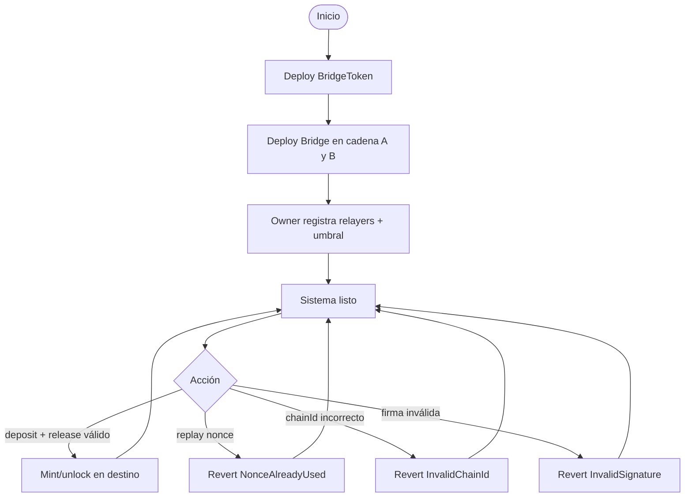
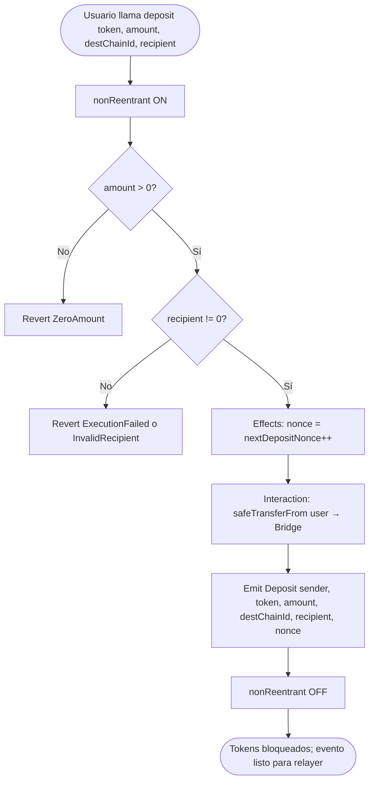
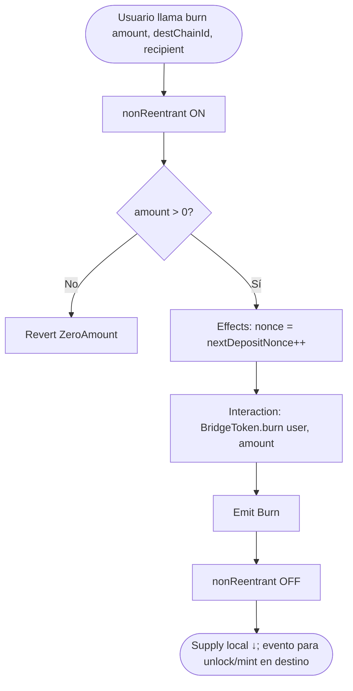
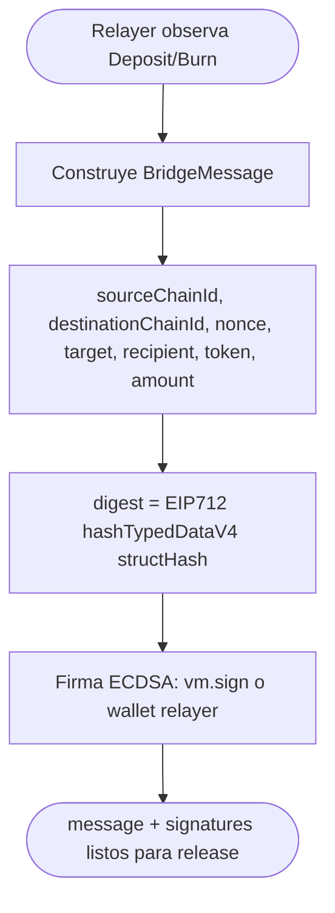
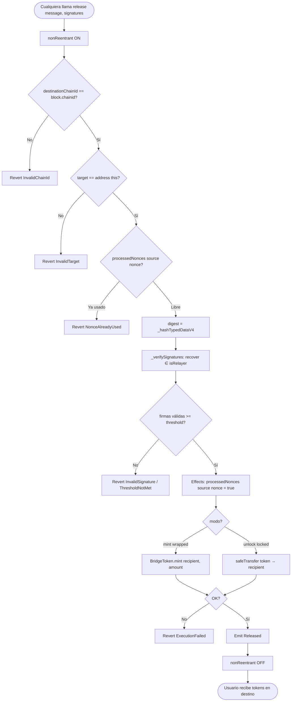
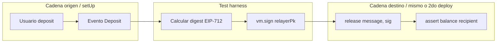
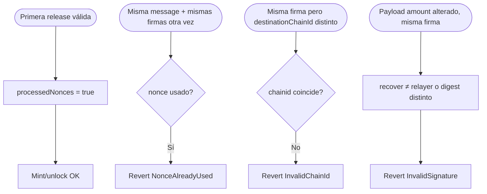
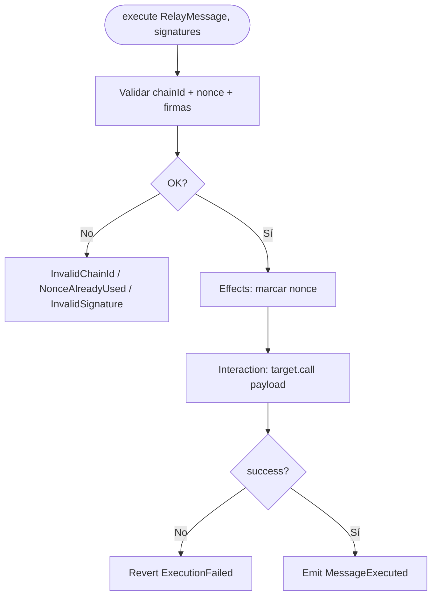
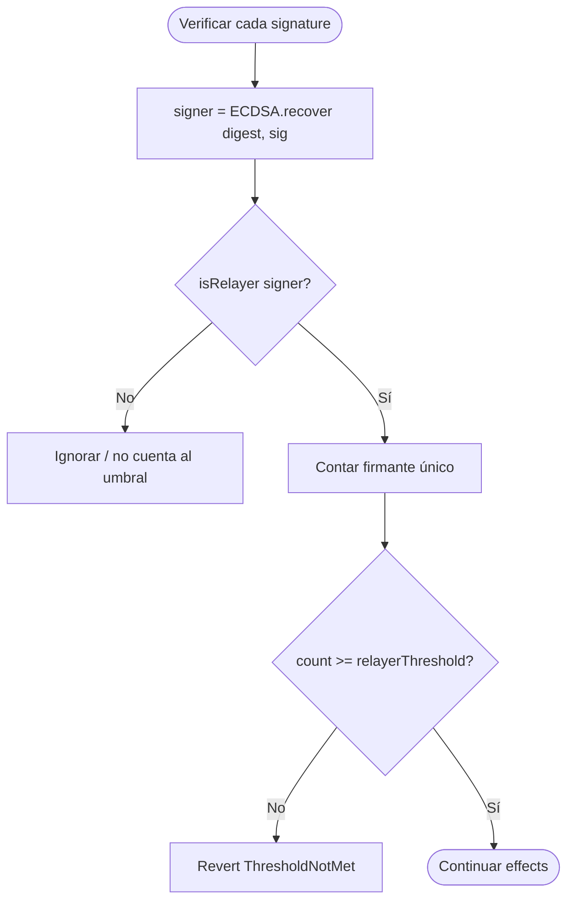

# Diagrama de flujo — Cross-Chain Bridge & Message Relay

Flujos de negocio **to-be** (v1). Ver también [flujograma.md](./flujograma.md) y [PLANIFICACION.md](./PLANIFICACION.md).

## 1. Ciclo de vida del sistema

## 2. Flujo origen: `deposit` (lock)

## 3. Flujo origen: `burn` (wrapped → otra cadena)

## 4. Flujo off-chain: firma EIP-712 (relayer / test)

En Foundry: `digest` se calcula igual que on-chain; `(v, r, s) = vm.sign(relayerPk, digest)`.

## 5. Flujo destino: `release` (mint / unlock)

## 6. Flujo e2e (test Foundry)

## 7. Flujo anti-replay

## 8. Flujo MessageRelay.execute

## 9. Flujo de autenticación de relayers

Firmas duplicadas del mismo relayer no deben contar dos veces hacia el umbral.

## Leyenda

| Símbolo | Significado |
|---------|-------------|
| Rectángulo | Proceso / acción on-chain |
| Diamante | Decisión / validación |
| Óvalo | Inicio / fin |

## Orden CEI

| Paso | `deposit` / `burn` | `release` |
|------|--------------------|-----------|
| **Checks** | amount, recipient | chainId, target, nonce libre, firmas |
| **Effects** | incrementar nonce depósito | `processedNonces[...] = true` |
| **Interactions** | transferFrom / burn | mint / transfer / call |
| **Checks finales** | — | éxito de mint/transfer o `ExecutionFailed` |
