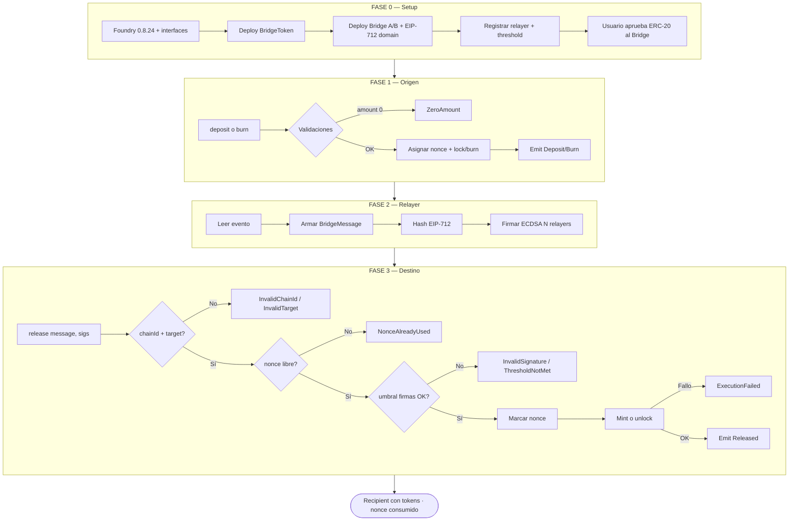
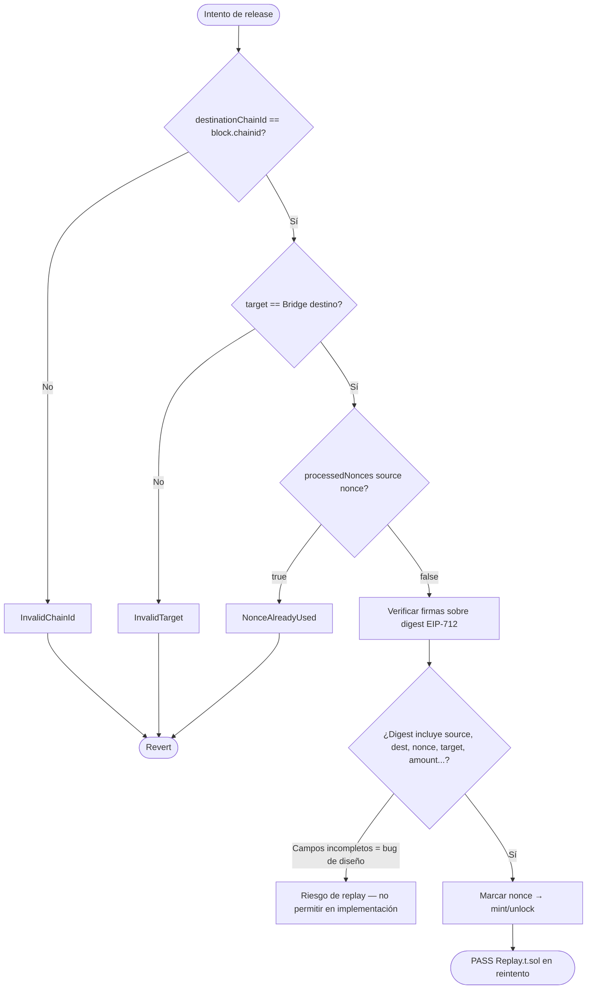
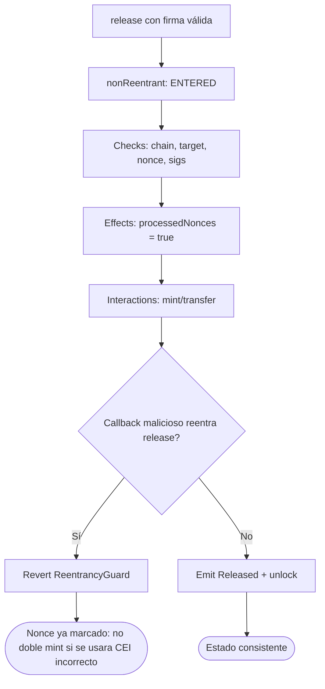
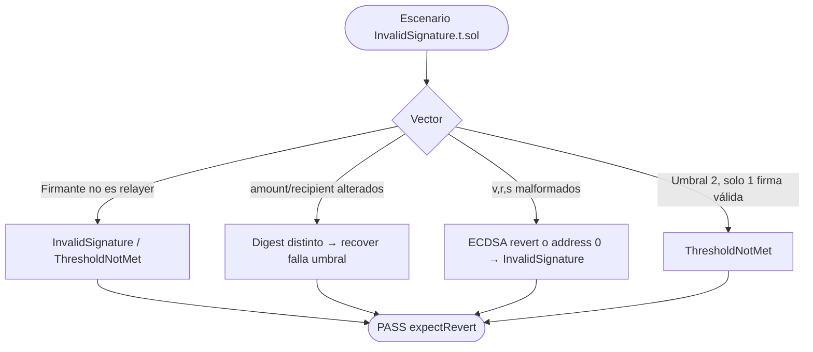
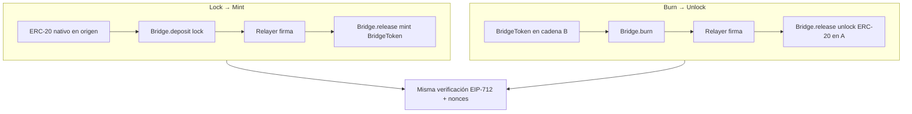

# Flujograma del proyecto — Cross-Chain Bridge & Message Relay

Flujograma operativo **to-be** (v1): setup → deposit/burn → firma → release → anti-replay → seguridad → TDD.

## 1. Flujograma maestro del sistema

## 2. Flujograma detallado anti-replay

El digest **debe** incluir los cuatro campos de guarda del módulo: `sourceChainId`, `destinationChainId`, `nonce`, `target`.

## 3. Flujograma de seguridad (reentrancy + CEI)

Marcar el nonce **antes** del mint evita doble acuñación aunque falle la protección de reentrada en un escenario hipotético.

## 4. Flujograma firmas inválidas

## 5. Flujograma del pipeline de desarrollo (TDD)

```mermaid
flowchart LR
    A[.cursorrules] --> B[Docs planificación + diagramas]
    B --> C[Scaffold Foundry + interfaces]
    C --> D[Tests e2e rojos]
    D --> E[BridgeToken + deposit]
    E --> F[release + vm.sign]
    F --> G[Replay.t.sol]
    G --> H[InvalidSignature.t.sol]
    H --> I[MessageRelay + umbral N-of-M]
    I --> J[Fuzz amount/chainId/nonce]
    J --> K[Gas + NatSpec + Deploy]
    K --> L([Módulo cerrado])
```

## 6. Matriz flujo ↔ función ↔ invariante

| Paso del flujograma | Función | Invariante / postcondición |
|---------------------|---------|----------------------------|
| Lock origen | `Bridge.deposit` | balance Bridge ↑; evento con nonce único |
| Burn origen | `Bridge.burn` | supply wrapped ↓; evento |
| Firma | off-chain / `vm.sign` | digest = mismo `_hashTypedDataV4` on-chain |
| Release OK | `Bridge.release` | `processedNonces` true; recipient ↑ amount |
| Replay | `Bridge.release` | segundo call → `NonceAlreadyUsed` |
| Chain wrong | `Bridge.release` | `InvalidChainId` |
| Firma bad | `Bridge.release` | `InvalidSignature` / `ThresholdNotMet` |
| Mensaje genérico | `MessageRelay.execute` | call OK o `ExecutionFailed`; nonce marcado |
| Reentrada | `release` / `deposit` | segunda entrada revierte |

## 7. Flujograma lock-mint vs burn-unlock

## 8. Cómo leer estos diagramas

1. **Setup**: token wrapped, Bridge(s), relayers y umbral.
2. **Origen**: el usuario deja liquidez (lock) o quema wrapped; el nonce queda en el evento.
3. **Relayer**: firma el struct EIP-712 completo (no solo el hash del evento crudo sin domain).
4. **Destino**: validar cadena, target, nonce y umbral → marcar nonce → mint/unlock.
5. **TDD**: docs → tests rojos e2e → implementación → replay/firmas → fuzz → cierre.
